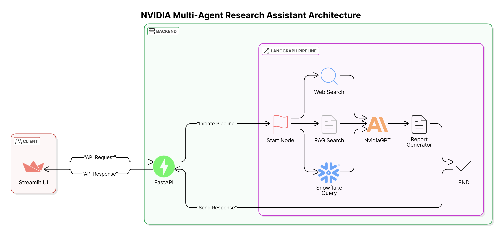

# NVIDIA Multi-Agent Research Assistant

This repository implements a multi-agent research assistant integrating :

- **RAG Agent:** Uses Pinecone (index: `nvidia-reports`) with metadata filtering (namespaces like `2023q2`, `2024q1`, etc.) to retrieve historical NVIDIA quarterly reports.
- **Web Search Agent:** Uses SerpAPI for real-time web search related to NVIDIA.
- **Snowflake Agent:** Queries structured NVIDIA valuation measures stored in Snowflake and generates summary charts.

## NVIDIA Agentic Architecture Workflow



## Project Structure
```
project/
├── agents/
│   ├── rag_agent.py      # RAG-based document retrieval
│   ├── snowflake_agent.py # Financial data querying
│   └── websearch_agent.py # Real-time web search
│
├── langGraph/
│   ├── __init__.py
│   └── pipeline.py       # LangGraph orchestration
│
├── utils/
│   ├── __init__.py
│   └── pinecone_utils.py # Pinecone helper functions
│
├── .env                  # Environment variables
├── .gitignore           # Git ignore rules
├── config.toml          # Configuration settings
├── Dockerfile           # Container definition
├── main.py             # FastAPI backend
├── Makefile            # Build automation
├── requirements.txt     # Python dependencies
├── streamlit_app.py    # Frontend UI
└── README.md           # Documentation
```

## Prerequisites

- Python 3.10+
- Poetry for dependency management
- Docker (optional)
- AWS account for S3 access
- Pinecone account
- Snowflake account
- SerpAPI key


Architecture Components:
----------------------


1. State Management
   - Uses NvidiaGPTState TypedDict for maintaining pipeline state
   - Tracks inputs, intermediate results, and final outputs
   - Manages conversation history and agent reasoning steps

2. Node Structure:
   - start_node: Entry point, processes initial query
   - web_search_node: Real-time web data collection
   - rag_search_node: Historical document retrieval (Pinecone)
   - snowflake_node: Financial metrics querying
   - agent_node: LLM-based analysis integration
   - report_generator_node: Final report compilation

Flow Sequence:
------------
 ```
                        → Web Search   
Start Node              → RAG Search   →  NvidiaGPT → Report Generator → END
                        → Snowflake    
```
   
Data Processing:
--------------
1. Input Processing
   - Query analysis and search type determination
   - Period selection for targeted analysis

2. Parallel Data Collection
   - Web scraping for current information
   - RAG-based document retrieval
   - Snowflake financial metrics

3. Analysis Integration
   - Claude 3 Haiku model for analysis
   - Tool-augmented reasoning
   - Multi-source data synthesis

4. Report Generation
   - Structured output formatting
   - Key findings compilation
   - Source attribution

Key Features:
-----------
- Hybrid search capabilities (vector + metadata)
- Error handling and recovery
- State persistence across nodes
- Parallel execution paths
- Modular tool integration
- Visualization support

Tools Integration:
---------------
- Web Search: SerpAPI integration
- RAG: Pinecone vector store
- Database: Snowflake connection
- LLM: Anthropic Claude 3
- Visualization: Graphviz

State Flow:
---------
{
    input → question → parallel_processing → 
    analysis → report_generation → final_output
}

Error Handling:
-------------
- Per-node exception management
- Graceful degradation
- Detailed error reporting
- Recovery mechanisms

Usage:
-----
pipeline = build_pipeline()
result = pipeline.invoke({
    "input": "query",
    "search_type": "All Quarters|Specific Quarter",
    "selected_periods": ["2023q4"]
})
"""


## Environment Setup

1. **Environment Variables:**  
   Create a `.env` file with:
   ```
   PINECONE_API_KEY=your_key
   OPENAI_API_KEY=your_key
   SERP_API_KEY=your_key
   SNOWFLAKE_USER=your_user
   SNOWFLAKE_PASSWORD=your_password
   SNOWFLAKE_ACCOUNT=your_account
   SNOWFLAKE_WAREHOUSE=your_warehouse
   SNOWFLAKE_DATABASE=your_database
   SNOWFLAKE_SCHEMA=your_schema
   AWS_SERVER_PUBLIC_KEY=your_key
   AWS_SERVER_SECRET_KEY=your_key
   AWS_REGION=your_region
   ```

2. **Install Dependencies:**
   ```bash
   # Using pip
   pip install -r requirements.txt

   # Using Poetry
   poetry install
   ```

## Running the Application

1. **Start Backend:**
   ```bash
   # Using Make
   make backend

   # Manual
   uvicorn main:app --host 0.0.0.0 --port 8080 --reload
   ```

2. **Start Frontend:**
   ```bash
   # Using Make
   make frontend

   # Manual
   streamlit run streamlit_app.py --server.port 8501
   ```

## Docker Deployment

1. **Build Images:**
   ```bash
   make fastapibuild
   make streamlitbuild
   ```

2. **Run Containers:**
   ```bash
   make fastapirun
   make streamlitrun
   ```

## Available Make Commands

- `make install`: Install dependencies
- `make backend`: Start FastAPI server
- `make frontend`: Start Streamlit UI
- `make snowflake`: Run Snowflake agent tests
- `make ragagent`: Run RAG agent tests
- `make pipeline`: Test LangGraph pipeline
- `make cleanup`: Stop and remove containers

## API Endpoints

- `POST /research_report`: Generate comprehensive research report
  ```json
  {
    "question": "string",
    "search_type": "string",
    "selected_periods": ["string"]
  }
  ```

##Deployed Links
- **FASTAPI** = https://fastapi-agentic-app-84150543519.us-central1.run.app/docs
- **STREAMLIT** = https://nvidia-research-assistant.streamlit.app/
- **GOOGLE CODELABS** = (https://codelabs-preview.appspot.com/?file_id=https://docs.google.com/document/d/1ICUz9IDBFdY6gg08xEMlXLj2zhaEvnilhxXG8se3FGs/edit?tab=t.0#0)

## Contributing

1. Fork the repository
2. Create feature branch
3. Commit changes
4. Push to branch
5. Create Pull Request

## License

This project is licensed under the MIT License - see the LICENSE file for details.

## Acknowledgments

- Uses LangChain for agent orchestration
- Pinecone for vector storage
- Snowflake for financial data
- SerpAPI for web search
- Streamlit for UI
- FastAPI for backend

## Authors

- Yash Khavnekar
- Shushil Girish
- Riya Mate

## FAQ

Q: How do I configure different quarters for search?
A: Use the sidebar in the UI to select specific quarters or "All Quarters"

Q: Where is the financial data stored?
A: Financial metrics are stored in Snowflake in the Valuation_Measures table

Q: How often is the data updated?
A: Web search is real-time, financial data is updated quarterly
